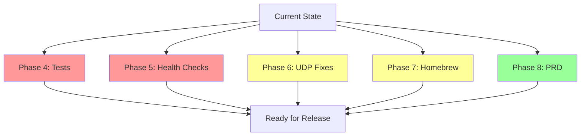

# Remaining Work Plan: CLI-QoS

## Current Status Summary

| Component | Status | Notes |
|-----------|--------|-------|
| [`qos-proxy/qos-proxy.go`](qos-proxy/qos-proxy.go) | ✅ Complete | HTTP/HTTPS/SOCKS5 proxy with token bucket rate limiting |
| [`qos-guard`](qos-guard) | ✅ Complete | Bash CLI with proxy-based architecture |
| [`Makefile`](Makefile) | ✅ Complete | Proxy build/install targets included |
| [`README.md`](README.md) | ✅ Complete | Proxy architecture documented |
| [`INSTALL.md`](INSTALL.md) | ✅ Complete | Installation instructions updated |
| [`Formula/qos-guard.rb`](Formula/qos-guard.rb) | ⚠️ Partial | Needs Go dependency handling |
| [`tests/test-qos-guard.bats`](tests/test-qos-guard.bats) | ⚠️ Partial | Tests need proxy-based validation |
| [`implementation.md`](implementation.md) | ⚠️ Partial | Phase tracking needs update |
| [`architecture-redesign.md`](architecture-redesign.md) | ✅ Complete | Architecture documented |
| [`user-stories.md`](user-stories.md) | ✅ Complete | 20 stories across 8 epics |
| [`prd.md`](prd.md) | ⚠️ Partial | Still references pf/dummynet architecture |

---

## Remaining Work Items

### Phase 3: Documentation (Complete)

**Status:** Already done. [`README.md`](README.md), [`INSTALL.md`](INSTALL.md), and [`architecture-redesign.md`](architecture-redesign.md) are all updated with proxy architecture.

**Action:** Mark as complete in [`implementation.md`](implementation.md).

---

### Phase 4: Test Updates

**Status:** Tests exist but need review for proxy-based architecture accuracy.

#### 4.1 Test Gaps Identified

| Test Category | Current State | Issue |
|---------------|---------------|-------|
| Proxy discovery | ✅ Tests exist | Tests check for grep patterns, not actual behavior |
| Proxy management | ⚠️ Partial | `proxy starts successfully` test uses dry-run, not actual proxy |
| Proxy env vars | ✅ Tests exist | Tests check for grep patterns in script |
| Bandwidth validation | ✅ Tests exist | Tests use `--dry-run` which is correct |
| Interface detection | ✅ Tests exist | Tests use `--dry-run` with real interface |
| Argument parsing | ✅ Tests exist | Tests use `--dry-run` |
| Dry-run mode | ✅ Tests exist | Tests verify dry-run output |
| Signal handling | ⚠️ Partial | Tests check for grep patterns, not actual signal behavior |
| Child process tracking | ⚠️ Partial | Tests check for grep patterns, not actual tracking |
| Help/version | ✅ Tests exist | Tests verify actual output |
| Restore | ⚠️ Partial | Tests skip without sudo, minimal coverage |
| Verbose output | ⚠️ Partial | Tests use dry-run, not actual verbose mode |
| Error handling | ✅ Tests exist | Tests verify error messages |

#### 4.2 Recommended Test Updates (Unit Tests Focus)

| # | Task | Priority | Description |
|---|------|----------|-------------|
| 4.1 | Unit test `validate_bandwidth()` | P0 | Test all bandwidth format parsing paths |
| 4.2 | Unit test `detect_interface()` | P0 | Test interface detection logic with mocked inputs |
| 4.3 | Unit test `convert_to_kbps()` | P0 | Test percentage and absolute conversions |
| 4.4 | Unit test `find_proxy_binary()` | P0 | Test proxy discovery from all locations |
| 4.5 | Unit test `set_proxy_env()` | P0 | Test proxy env var format and values |
| 4.6 | Unit test `restore_rules()` | P1 | Test stale process cleanup logic |
| 4.7 | Unit test `get_process_group_pids()` | P1 | Test child process tracking |
| 4.8 | Add proxy health check tests | P1 | Test `check_proxy_health()` function |
| 4.9 | Remove obsolete pf tests | P1 | Remove tests for old pf/dummynet approach |

---

### Phase 5: Proxy Health Checks

**Status:** Not started.

#### 5.1 Health Check Requirements

| # | Task | Priority | Description |
|---|------|----------|-------------|
| 5.1 | Add proxy health check in qos-guard | P0 | Verify proxy is running before executing command |
| 5.2 | Add proxy restart on failure | P1 | Auto-restart proxy if it crashes |
| 5.3 | Add port conflict detection | P1 | Detect if proxy port is already in use |
| 5.4 | Add proxy timeout handling | P2 | Timeout if proxy doesn't start within N seconds |

#### 5.2 Implementation Design

```bash
# In qos-guard, add health check function:

check_proxy_health() {
    if [[ -z "${PROXY_PID}" ]] || ! kill -0 "${PROXY_PID}" 2>/dev/null; then
        log_error "Proxy process died unexpectedly"
        return 1
    fi
    
    # Check if port is listening
    if ! lsof -i ":${PROXY_PORT}" >/dev/null 2>&1; then
        log_error "Proxy port ${PROXY_PORT} is not listening"
        return 1
    fi
    
    return 0
}

# Call after start_proxy():
if ! check_proxy_health; then
    log_error "Proxy health check failed"
    return 1
fi
```

---

### Phase 6: UDP Limiting Improvements

**Status:** Partially implemented in [`qos-guard`](qos-guard) (lines 272-332).

#### 6.1 Current State

The `apply_udp_limit()` and `remove_udp_limit()` functions exist but have issues:

| Issue | Description | Fix |
|-------|-------------|-----|
| pf anchor syntax | `pfctl -a "qosguard/udp_limit" -K all` is invalid | Use `pfctl -a "qosguard/udp_limit" -N anchor` |
| dummynet pipe config | No pipe created before referencing it | Create pipe with `pfctl -p pipe` |
| Interface-level scope | Limits ALL traffic, not just target process | Document as limitation |
| No sudo check | Functions fail silently without sudo | Add explicit sudo check |

#### 6.2 Recommended UDP Implementation

```bash
apply_udp_limit() {
    local interface="$1"
    local limit_kbps="$2"
    
    # Check sudo
    if [[ "$(id -u)" -ne 0 ]]; then
        log_warn "UDP limiting requires sudo. Skipping UDP limiting."
        return 0  # Don't fail, just warn
    fi
    
    # Create pf anchor
    pfctl -a "qosguard/udp_limit" -N anchor 2>/dev/null || true
    
    # Create dummynet pipe
    local pipe_id=$((RANDOM % 9000 + 1000))
    pfctl -a "qosguard" -p pipe "qosguard-udp-${pipe_id}" config bw "${limit_kbps}Kbit" 2>/dev/null || {
        log_warn "Failed to create dummynet pipe"
        return 1
    }
    
    # Apply dummynet rule to interface
    pfctl -a "qosguard" -f - <<EOF
dummynet out on ${interface} proto udp pipe "qosguard-udp-${pipe_id}"
EOF
    
    UDP_INTERFACE="${interface}"
    UDP_PIPE_ID="${pipe_id}"
    UDP_RULE_APPLIED=true
    log_verbose "UDP limiting applied on ${interface} with ${limit_kbps}Kbit (pipe ${pipe_id})"
    return 0
}

remove_udp_limit() {
    if [[ "${UDP_RULE_APPLIED}" != "true" ]]; then
        return
    fi
    
    if [[ "$(id -u)" -eq 0 ]]; then
        pfctl -a "qosguard/udp_limit" -F all 2>/dev/null || true
        pfctl -a "qosguard" -f - <<EOF
dummynet flush
EOF
    fi
    
    UDP_RULE_APPLIED=false
    log_verbose "UDP limiting removed"
}
```

---

### Phase 7: Homebrew Formula + Tap Preparation

**Status:** Formula exists at [`Formula/qos-guard.rb`](Formula/qos-guard.rb) but needs updates. Tap needs to be prepared.

#### 7.1 Current Issues

| Issue | Description | Fix |
|-------|-------------|-----|
| URL points to non-existent release | `url "https://github.com/nicely-deep/CLI-QoS/releases/download/v1.0.0/qos-guard-v1.0.0.tar.gz"` | Update to git URL with tag |
| SHA256 is placeholder | `sha256 "UPDATE_WITH_ACTUAL_SHA256"` | Remove when using git URL |
| Go build requires Go | Formula builds qos-proxy from source | Add `depends_on go:build` |
| No qos-proxy distribution | Formula only installs qos-guard | Add qos-proxy build step |

#### 7.2 Recommended Formula

```ruby
class QosGuard < Formula
  desc "CLI tool for per-process bandwidth limiting using proxy-based QoS"
  homepage "https://github.com/nicely-deep/CLI-QoS"
  url "https://github.com/nicely-deep/CLI-QoS.git",
      :tag => "v1.0.0",
      :revision => "COMMIT_SHA"
  
  license "MIT"
  
  depends_on :macos
  depends_on "go" => :build
  
  def install
    # Install qos-guard shell script
    bin.install "qos-guard"
    
    # Build qos-proxy from Go source
    cd "qos-proxy" do
      system "go", "build", "-ldflags", "-s -w", "-o", "../qos-proxy"
    end
    bin.install "qos-proxy"
  end
  
  def test
    # Verify qos-guard version output
    assert_match version.to_s, shell_output("#{bin}/qos-guard --version")
    
    # Verify qos-proxy is installed
    assert_match /qos-proxy/, shell_output("#{bin}/qos-proxy --help 2>&1")
  end
end
```

#### 7.3 Homebrew Tap Preparation

Create a new Homebrew tap repository:

```bash
# Create tap repository
gh repo create nicely-deep/homebrew-qos-guard --public
cd ~/.homebrew  # or HOMEBREW_PREFIX

# Clone the tap
git clone https://github.com/nicely-deep/homebrew-qos-guard.git
cd homebrew-qos-guard

# Create Formula directory structure
mkdir -p Formula

# Copy the formula
cp ~/Development/CLI-QoS/Formula/qos-guard.rb Formula/

# Commit and push
git add Formula/qos-guard.rb
git commit -m "Add qos-guard formula"
git push
```

Install from tap:
```bash
brew tap nicely-deep/qos-guard
brew install qos-guard
```

---

### Phase 8: PRD Architecture Update

**Status:** [`prd.md`](prd.md) still references the old pf/dummynet architecture.

#### 8.1 Required PRD Updates

| # | Section | Change |
|---|---------|--------|
| 8.1 | 1.2 Solution | Update to proxy-based approach |
| 8.2 | 6.1 System Design | Update architecture diagram |
| 8.3 | 6.2 Network Flow | Update to proxy flow |
| 8.4 | 6.3 Key Design Decisions | Update tech stack to Go proxy |
| 8.5 | 7. User Stories | Update to reflect proxy architecture |
| 8.6 | 8. Acceptance Criteria | Update verification methods |
| 8.7 | 10. Risks | Add proxy-related risks |

---

## Summary of Remaining Work

| Phase | Task | Priority | Effort |
|-------|------|----------|--------|
| Phase 4 | **Unit** test updates | P0 | 3 hours |
| Phase 5 | Proxy health checks | P0 | 2 hours |
| Phase 6 | UDP limiting fixes | P1 | 2 hours |
| Phase 7 | Homebrew formula + tap prep | P1 | 2 hours |
| Phase 8 | PRD update | P2 | 1 hour |
| **Total** | | | **~10 hours** |

---

## Implementation Priority

| Priority | Item | Dependencies |
|----------|------|--------------|
| **P0** | Test updates (Phase 4) | None |
| **P0** | Proxy health checks (Phase 5) | None |
| **P1** | UDP limiting fixes (Phase 6) | None |
| **P1** | Homebrew formula (Phase 7) | None |
| **P2** | PRD update (Phase 8) | None |

---

## Mermaid: Remaining Work Flow



---

## User Decisions

| Decision | Choice |
|----------|--------|
| Test priority | Unit tests (function-level) |
| UDP limiting | Interface-level is acceptable |
| Homebrew tap | Prepare a new tap |
| PRD update | Update to reflect proxy architecture |
